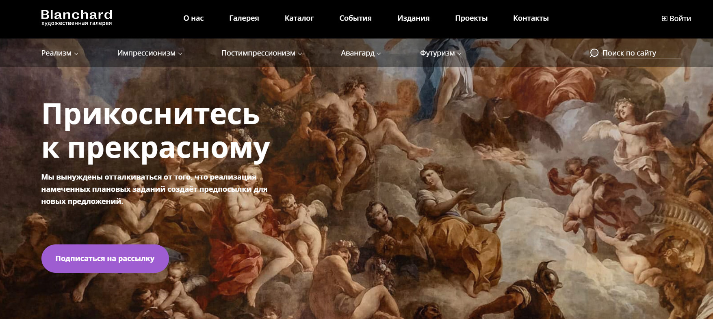

# HTML-верстальщик / Frontend-разработчик

<table>
  <tr>
    <td></td>
    <td>
      <table>
        <tr>
          <td>
            <h2>
              Халевин Сергей
            </h2>
          </td>
        </tr>
        <tr>
          <td>
            Телефон:
            <b>+7(913)189-20-88</b>
          </td>
        </tr>
        <tr>
          <td>
            Email:
            <b>dreftware@yandex.ru</b>
          </td>
        </tr>
        <tr>
          <td>
            Telegram:
            <b>@KomanDante999</b>
          </td>
        </tr>
        <tr>
          <td>
            Город проживания:
            <b>Лесосибирск</b>
          </td>
        </tr>
        <tr>
          <td>
            Дата Рождения:
            <b>06.12.1974</b>
          </td>
        </tr>
      </table>
    </td>
  </tr>
</table>

---

---

### hard skills:

| HTML | CSS3 | JS ES6+ | VUE 3 | GSAP | Tailwind CSS |
| ---- | ---- | ------- | ----- | ---- | ------------ |
| Git  | Gulp | Sass    | Less  | Pug  | BEM          |

### soft skills:

- **_самостоятельность_** в решении проблем, обучении, освоении новых знаний
- **_ответсвенность_** за порученную работу, желание сделать ее как можно качественнее
- **_коммуникабельность_**, **_отзывчивость_**, всегда готов прийти на помощь, интереся коллектива ставлю выше личных

---

---

## мои основные проекты:

### **_1. Blanchard - художественная галлерея (HTML, CSS)_**

> Адаптивная веб-страница с подключением плагинов swiper.js, jQuery accordion, tab, choices, popper, tippy, just-validate, inputmask, yandex-map.

[Посмотреть код в репозитории](https://github.com/KomanDante999/Blanchard-deploy.git "перейти на  Github")

### ТЗ:

- **_Адаптивная_** вёрстка, корректно отображающаяся на компьютере, планшете и мобильном устройстве
- **_Кроссбраузерность_**, корректное отображение в Chrome, Firefox, Safari, Opera, Edge
- **_Pixel Perfect_** вёрстка (под все разрешения). Отличия на 1–3 пикселя.
- **_Сlean code_**. Чистая семантическая вёрстка. Минимум тегов и вложенностей.
- **_Accessibility_**. Интерфейс сайта доступен с клавиатуры и при использовании скринридера.
- **_БЭМ_** - именование классов. Отсутствуют элементы без блока, модификаторы без блока или элемента, модификаторы модификаторов.
- **_Usability_**. Удобный для пользователя интерфейс: все кнопки и ссылки явно дают понять, что на них можно кликнуть, нет неожиданного поведения элементов.
- Теги HTML- и CSS-документов должны быть **_валидными_**
- На мобильных устройствах ховеры не должны работать. Минимум медиазапросов для реализации адаптива
- Флексбокс-вёрстка, без использования фреймворков.
