# HTML-верстальщик / Frontend-разработчик

<table>
  <tr>
    <td></td>
    <td>
      <table>
        <tr>
          <td>
            <h2>
              Халевин Сергей
            </h2>
          </td>
        </tr>
        <tr>
          <td>
            Телефон:
            <b>+7(913)189-20-88</b>
          </td>
        </tr>
        <tr>
          <td>
            Email:
            <b>dreftware@yandex.ru</b>
          </td>
        </tr>
        <tr>
          <td>
            Telegram:
            <b>@KomanDante999</b>
          </td>
        </tr>
        <tr>
          <td>
            Город проживания:
            <b>Лесосибирск</b>
          </td>
        </tr>
        <tr>
          <td>
            Дата Рождения:
            <b>06.12.1974</b>
          </td>
        </tr>
      </table>
    </td>
  </tr>
</table>

---

### hard skills:

| HTML | CSS3 | JS ES6+ | VUE 3 | GSAP | Tailwind CSS | WordPress |
| ---- | ---- | ------- | ----- | ---- | ------------ | --------- |
| Git  | Gulp | Sass    | Less  | Pug  | BEM          |           |

### soft skills:

- **_самостоятельность_** в решении проблем, обучении, освоении новых знаний
- **_ответственность_** за порученную работу, желание сделать ее как можно качественнее
- **_коммуникабельность_**, **_отзывчивость_**, всегда готов прийти на помощь, интересы коллектива ставлю выше личных

---
---

## ВЕРСТКА:

### **_RAIN IN THE FOREST (HTML, CSS, 3D)_**

> Красивый сайт-визитка с 3D эффектом Parallax на чистом CSS.

<a href="https://komandante999.github.io/wd_rain-in-forest-3d/">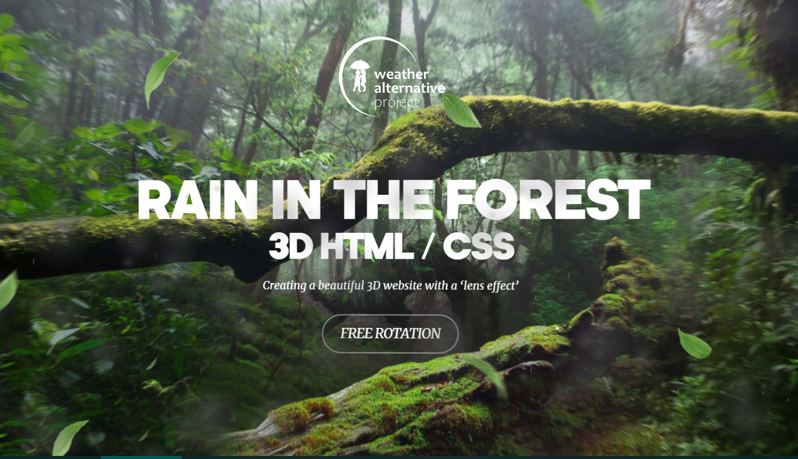</a>

[Посмотреть код в репозитории](https://github.com/KomanDante999/wd_rain-in-forest-3d.git "перейти на  Github")

### Технологии:
- Использование **_Object.assign_** для трансляции координат курсора в CSS переменные.
- Реализация эффекта глубины посредством нативных средств **_perspective_** и **_translateZ_** для нескольких слоев.
- Управление степенью ротации с помощью вычислений **_calc_**.
- **_Резиновая адаптивность_** на любых разрешениях и соотношениях сторон экрана - все размеры элементов вычисляются на основе одного коэффициента.
- Использование **_canvas_** для создания эффекта дождя.
---

### **_CREATIVE SCROLL (HTML, CSS, GSAP)_**

> Красивый сайт-портфолио с паралакс-эффектом, плавным скроллом, анимацией карточек при прокрутке, реализованных библиотекой GreenSock.

<a href="https://komandante999.github.io/wd-creative-scroll/"></a>

[Посмотреть код в репозитории](https://github.com/KomanDante999/wd-creative-scroll.git "перейти на  Github")

### Технологии:
- Использование **_ScrollSmoother_** для управления плавной прокруткой сайта.
- Использование **_ScrollSmoother_** для задания различной скорости прокрутки различных элементов сайта.
- Использование **_ScrollTrigger_** для управления анимацией элементов в зависимости от их появления на экране.
---

### **_BLANCHARD - художественная галерея (HTML, CSS)_**

> Адаптивная веб-страница с подключением плагинов swiper.js, jQuery accordion, tab, choices, popper, tippy, just-validate, inputmask, yandex-map.

<a href="https://komandante999.github.io/Blanchard-deploy/"></a>

[Посмотреть код в репозитории](https://github.com/KomanDante999/Blanchard-deploy.git "перейти на  Github")

### Требования ТЗ:
- **_Адаптивная_** вёрстка, корректно отображающаяся на компьютере, планшете и мобильном устройстве
- **_Кроссбраузерность_**, корректное отображение в Chrome, Firefox, Safari, Opera, Edge
- **_Pixel Perfect_** вёрстка (под все разрешения). Отличия на 1–3 пикселя.
- **_Сlean code_**. Чистая семантическая вёрстка. Минимум тегов и вложенностей.
- **_Accessibility_**. Интерфейс сайта доступен с клавиатуры и при использовании скринридера.
- **_БЭМ_** - именование классов. Отсутствуют элементы без блока, модификаторы без блока или элемента, модификаторы модификаторов.
- **_Usability_**. Удобный для пользователя интерфейс: все кнопки и ссылки явно дают понять, что на них можно кликнуть, нет неожиданного поведения элементов.
- Теги HTML- и CSS-документов должны быть **_валидными_**
- На мобильных устройствах ховеры не должны работать. Минимум медиазапросов для реализации адаптива
- Флексбокс-вёрстка, без использования фреймворков.
---

### **_PHOTO - портфолио (HTML, CSS, GSAP)_**
> Сайт-визитка с анимацией при загрузке сайта и открытия бургерного меню.

<a href="https://komandante999.github.io/PHOTO/">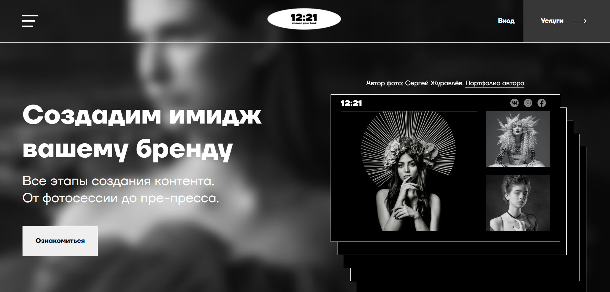</a>

[Посмотреть код в репозитории](https://github.com/KomanDante999/PHOTO.git "перейти на  Github")

### Требования ТЗ:
- С помощью инструментария библиотеки GreenSock реализуйте анимацию загрузки сайта.
- С помощью инструментария библиотеки GreenSock реализуйте анимацию открытия/закрытия бургер-меню
---

### **_EUCLID - строительная компания (HTML, CSS, Lighthouse)_**

> Одностраничный сайт с оптимизацией загрузки до зеленого сектора в Lighthouse.

<a href="https://komandante999.github.io/Euclid-optimization/">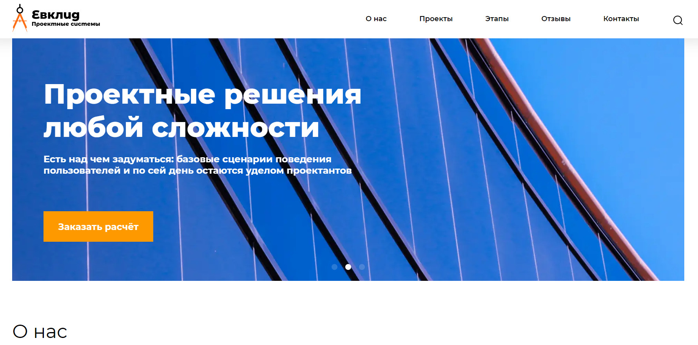</a>

[Посмотреть код в репозитории](https://github.com/KomanDante999/Euclid-optimization.git "перейти на  Github")

### Требования ТЗ:
- Семантичная валидная верстка с соблюдением код-стайл.
- Pixel perfect на каждом из макетов для адаптива.
- Именование классов по методологии **БЭМ**.
- Реализовать “резиновый” адаптив.
- Количество брейк-поинтов в медиа запросах не превышает семи.
- Не использовать Bootstrap.
- Реализовать все состояния интерактивных элементов: hover, focus, active.
- Протестировать на нескольких реальных устройствах (телефон, планшет).
- Реализовать возможность “хождения” по сайту с клавиатуры.
- Реализовать возможность пользоваться сайтом с помощью скринридера NVDA.
- Проверить сайт в следующих браузерах: Opera, Yandex, Chrome, Edge, Firefox, Safari.
- Проверить сайт на мобильных устройствах в нескольких браузерах на ваш iOS и Android.
- Реализовать слайдер с помощью библиотеки **Swiper-js**.
- Реализовать табы и аккордеон с помощью библиотеки **jQuery**.
- Оптимизировать HTML, JS, CSS, использовав минификаторы.
- Оптимизировать загрузку шрифтов с помощью preload.
- Оптимизировать изображения сервисом Squoosh, сделайть версии в формате WebP, подключив их через тег picture.
- Оптимизировать загрузку изображений, использовав Lazy Load.
- Проверить сайт в Lighthouse.

---
### **_3D MODELING - курсы 3D моделирования (HTML, CSS, Bootstrap)_**

> Одностраничный сайт c использованием библиотеки Bootstrap.

<a href="https://komandante999.github.io/3D-modeling-courses/"></a>

[Посмотреть код в репозитории](https://github.com/KomanDante999/3D-modeling-courses.git "перейти на  Github")

### Требования ТЗ:
- Семантияная валидная верстка с соблюдением код-стайл.
- Pixel perfect.
- Именование классов по методологии БЭМ.
- Сделать адаптивную верстку, используя классы **Bootstrap**, медиа-запросы и тег picture для адаптивности картинок.

---
### **_LAGOON - каталог отелей (HTML, CSS)_**

> Одностраничный сайт без функционала.

<a href="https://komandante999.github.io/Lagoona/"></a>

[Посмотреть код в репозитории](https://github.com/KomanDante999/Lagoona.git "перейти на  Github")

### Требования ТЗ:
- Семантияная валидная верстка.
- Правильная реализация контектстных и декоративных изображений.
- Соблюдение код-стайл.
- Использование flexbox модели для позиционирования элементов.
- Проверка верстки на переполнение.
- Pixel perfect.
- Верстка и стилизация элементов фориы.
- Использование псевдоэлементов и абсолютного позиционирования.
- Добавить эффекты состояния на активные элементы. Порядок состояний должен быть именно таким: focus, hover, active.
---

### **_HTML-EMAIL - письмо для компании Blanchard (HTML-4, CSS)_**

> HTML-письмо.

<a href="https://komandante999.github.io/HTML-email/">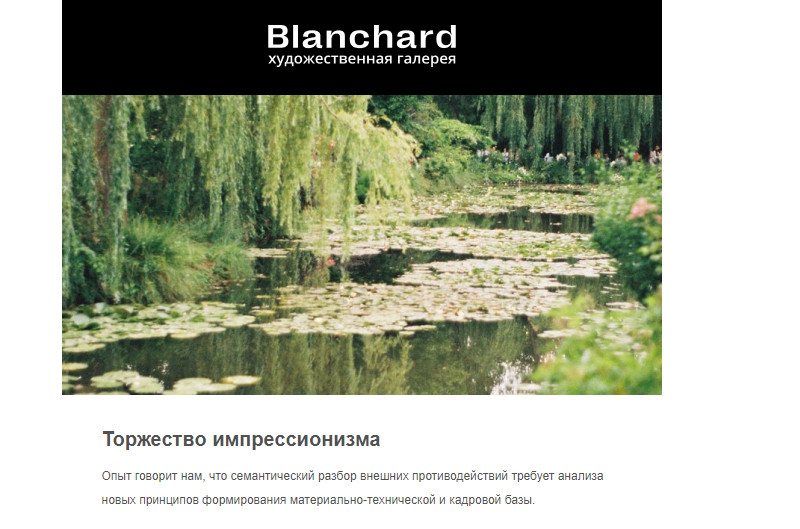</a>

[Посмотреть код в репозитории](https://github.com/KomanDante999/HTML-email.git "перейти на  Github")

### Требования ТЗ:
- Сверстайте HTML-письмо по макету.
- Уделить особое внимание качеству адаптивной верстки.
- Протестировать письмо в почтовых клиентах Outlook (не ниже версии 2013) и Gmail. Письмо должно корректно отображаться в десктопной, браузерных и в мобильных версиях.
- Протестировать письмо в Mail.ru, Yandex, Apple Mail, Windows 10 Mail, outlook.com, в десктопных, браузерных и мобильных версиях этих почтовых клиентов.
---
---

## ПРОЕКТЫ НА VUE:

### **_MOIRE - каталог премиального белья (VUE-3, Tailwind CSS)_**

`готов на 80%`

> Одностраничное приложение с основным функционалом интернет-магазина.

<a href="https://komandante999.github.io/moire/">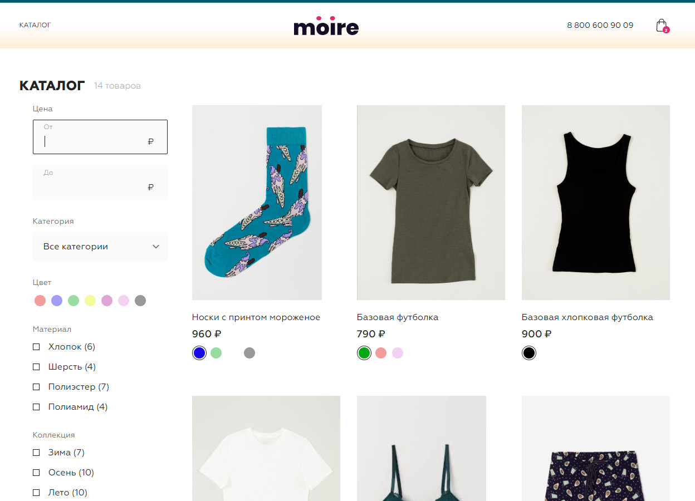</a>

[Посмотреть код в репозитории](https://github.com/KomanDante999/moire.git "перейти на  Github")

### Требования ТЗ:

- Просмотр списка товаров по страницам.
- Фильтрация списка товаров по параметрам.
- Просмотр информации о товаре на его детальной странице.
- Добавить товар с выбранным цветом и размером в корзину..
- Измененеи количества товаров в корзине.
- Удаление товаров из корзины.
- При перезагрузке страницы неотправленные данные из корзины сохраняются (Local Storage).
- Внести данные на странице оформления заказа.
- Выбрать способ доставки и оплаты.
- Оформить заказ и посмотреть информацию о нём на странице успешного оформления заказа.
- Реализовать Bread crumbs.
- Окружение приложения должно быть развёрнуто с использованием Vue CLI.
- В работе должен использоваться ESLint, vuex, vuerouter.
- Интерфейс должен быть отзывчивым: во время обращений к API показывается прелоадер, при возникновении пользовательских ошибок посетитель уведомляется о них.
---

### **_TECHNOZAVR - интернет-магазин (VUE-2)_**

> Одностраничное приложение с основным функционалом интернет-магазина.

<a href="https://komandante999.github.io/vue-tehnozavr/#/">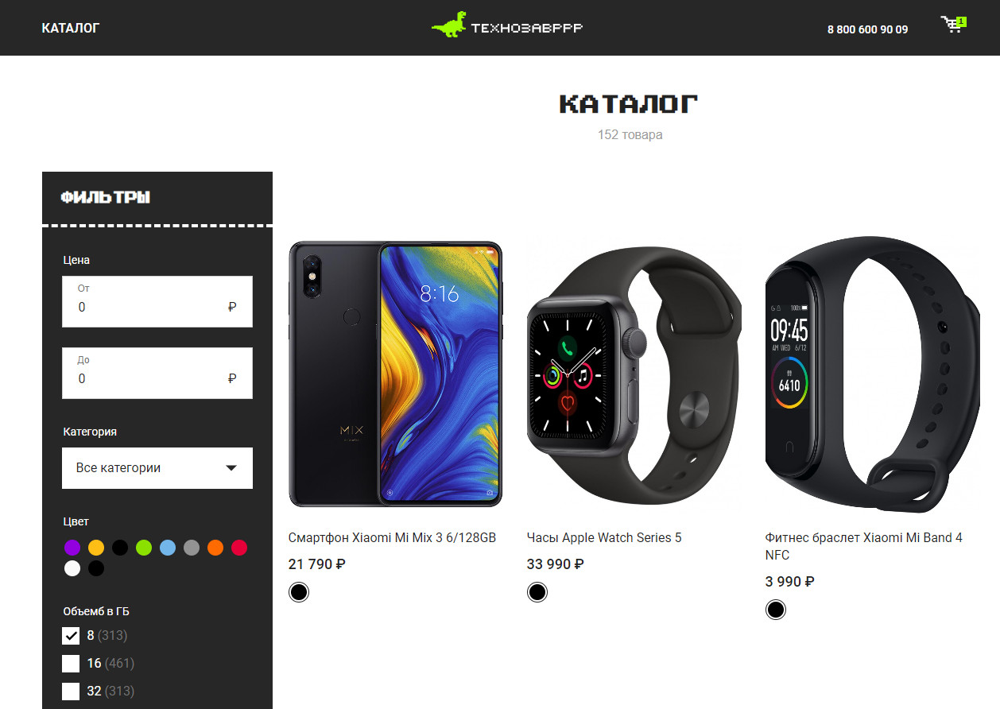</a>

[Посмотреть код в репозитории](https://github.com/KomanDante999/vue-skb-projeck01.git "перейти на  Github")

### Требования ТЗ:

- Просмотр списка товаров по страницам.
- Фильтрация списка товаров по параметрам.
- Просмотр информации о товаре на его детальной странице.
- Добавление товара в корзину.
- Измененеи количества товаров в корзине.
- Удаление товаров из корзины.
- При перезагрузке страницы неотправленные данные из корзины сохраняются (Local Storage).
- Внести данные на странице оформления заказа.
- Оформить заказ и посмотреть информацию о нём на странице успешного оформления заказа.
- Реализовать Bread crumbs
- Окружение приложения должно быть развёрнуто с использованием Vue CLI.
- В работе должен использоваться ESLint, vuex, vuerouter.
- Интерфейс должен быть отзывчивым: во время обращений к API показывается прелоадер, при возникновении пользовательских ошибок посетитель уведомляется о них.
---

### **_MAMOD - форма регистрации (VUE-2)_**

> простая форма регистрации на Vue-2.

<a href="#">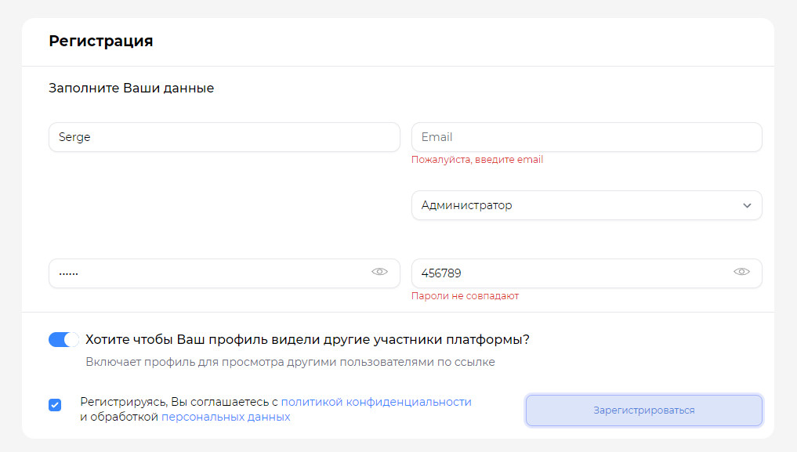</a>

[Посмотреть код в репозитории](https://github.com/KomanDante999/mamod-test.git "перейти на  Github")

### Требования ТЗ:
- Vue 2.
- Сверстать форму регистрации, согласно
  [макету](https://www.figma.com/file/RzfLe0cwuP26lGIy3bBgdz/MamodTestFrontend?type=design&node-id=0%3A1&mode=design&t=wpvbhcFaqv9EThYh)
- Варианты в селекте “Должность” - любой произвольный набор данных, в формате
  ```js
  [{ value: number, name: string }, { value: number, name: string }, ...etc];
  ```
- Чекбокс согласия на обработку персональных данных - по умолчанию установлен. Но если его выключить, то форма не должна отправляться.
- Реализовать функциональность отправки данных моковым POST запросом со следующими параметрами:
  ```js
  // Все поля обязательны
  public: boolean;
  username: string;
  role: number;
  email: string;
  password: string;
  password_repeat: string;
  ```
- Интерактивно отработать ошибку не введённых данных (подсветка поля, надпись под ним и тп.).
- При успешной регистрации - скрыть форму и отобразить текст “Регистрация успешно завершена” в произвольных стилях.
---
---

## ПРОЕКТЫ НА WORDPRESS:

### **_DVERI-MASTER (WordPress)_**

> Многостраничный сайт магазина дверей с администрированием через CMS WordPress

<a href="https://dveri.komandante999.ru/">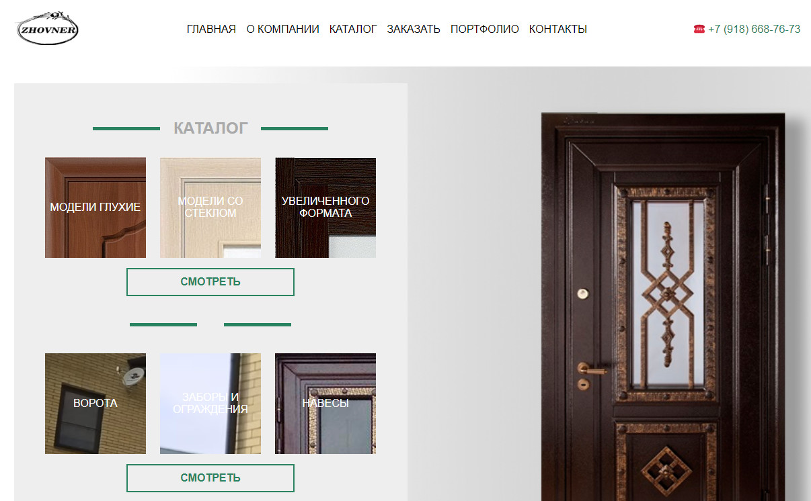</a>

[Посмотреть код в репозитории](https://github.com/KomanDante999/dveri-master.git "перейти на  Github")

### Использованные технологии:
- Развертывание локального сервера Open Server.
- Установка WordPress на локальный сервер.
- Создание собственной темы с нуля.
- Работа с плагинами Custom Field Suite и Contact Form 7
- Различные подходы к организации циклов для списков элементов - через нативные функции WordPress и через инструментарий плагина Custom Field Suite
- Использование шорткодов для форм обратной связи.
- Работа с хостингом, настройка базы данных, домена.
- Перенос сайта с локального сервера на хостинг, особенности настройки.

---
---

## ПРОЕКТЫ НА JS:

### **_AURORA-CRM (JS)_**

> Система управления контактными данными клиентов, взаимодействующая с локальным сервером.

<a href="https://komandante999.github.io/AURORA-CRM_demo/">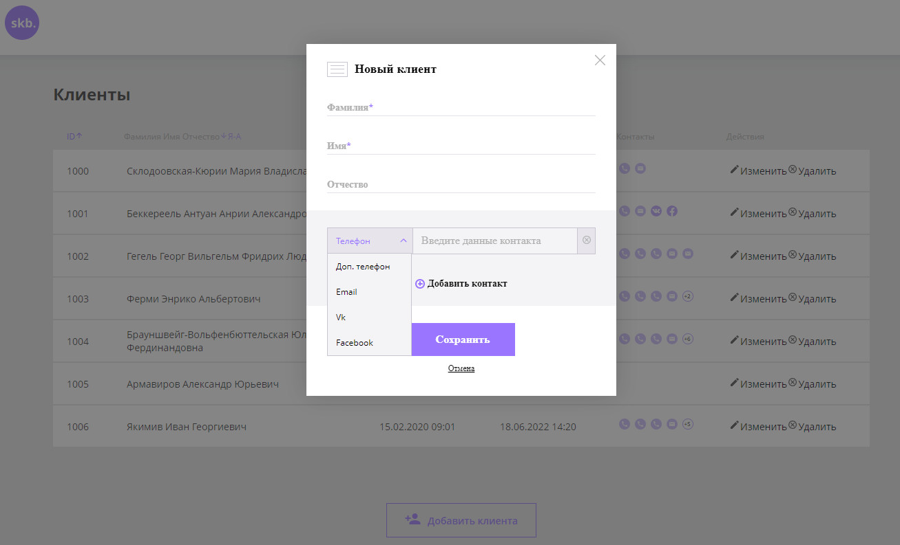</a>

(требует запуск локального сервера, имеется в репозитории)

[Посмотреть код в репозитории](https://github.com/KomanDante999/Aurora-CRM.git "перейти на  Github")

### Требования ТЗ:
- Просмотр списка клиентов в виде таблицы.
- Сортировка списка по полям.
- Просмотр информации клиента в модальном окне.
- Изменение информации о клиенте в модальном окне, добавление и удаление клиента.
- Поиск с авто-дополнением, переход из окна поиска в таблицу с клавиатуры.
- Валидация формы перед отправкой на сервер.
- Анимация открытия модального окна, индикация загрузки, всплывающие подсказки.

### Результат выполнения задания:

`были отработаны навыки использования модулей, классов, асинхронных функция JS, приемы работы с массивами в формате ES6, взаимодействие с API сервера`


### **_GAME-PAIRS - игра "Найди пару" (JS)_**

> простая игра на JS.

<a href="https://komandante999.github.io/game-PAIRS/">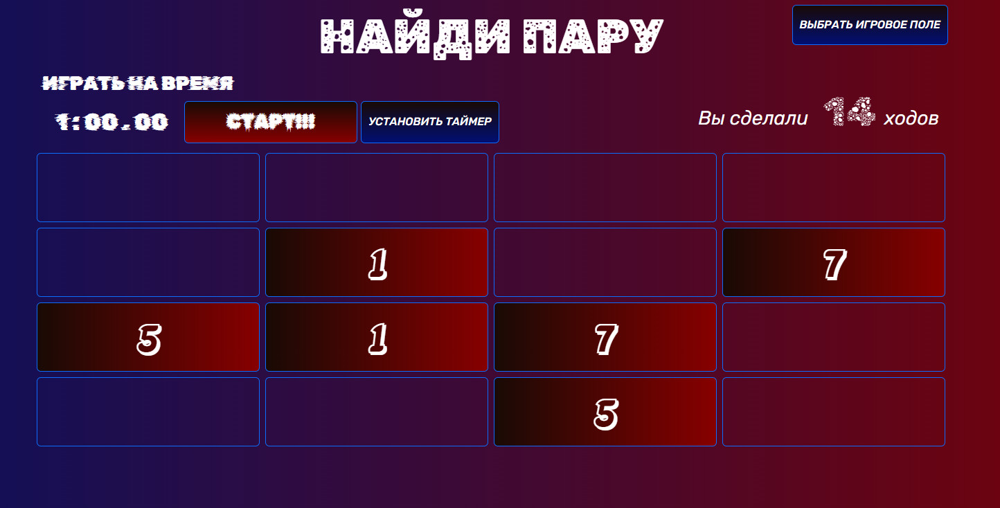</a>

[Посмотреть код в репозитории](https://github.com/KomanDante999/game-PAIRS.git "перейти на  Github")

### Требования ТЗ:

- Разработать простую игру в пары.
- Самостоятельно разработать дизайн игры.
- Создать функцию, генерирующую массив парных чисел.
- Создать функцию перемешивания массива с помощью алгоритма Фишера — Йетса.
- Создать функцию перемешивания массива с помощью алгоритма Фишера — Йетса.
- На основе массива создать DOM-элементы карточек.
- Добавить функцию настройки количество карточек на поле (в модальном окне).
- Реализовать таймер окончания игры по выбору игрока.
- Реализовать сообщение о результатах игры (в модальном окне).
---

### **_BLOG (JS, REST-API)_**

> простой блог с возможностью перехода к статье и комментариям с использованием REST-API.

<a href="https://komandante999.github.io/blog/">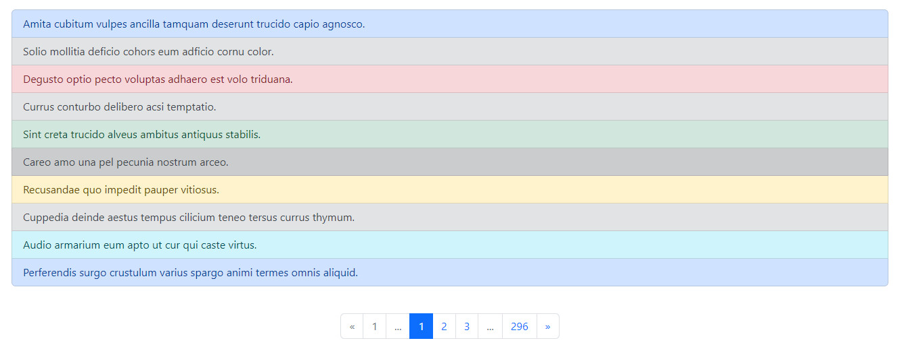</a>

[Посмотреть код в репозитории](https://github.com/KomanDante999/blog.git "перейти на  Github")

### Требования ТЗ:

- Разработать простую игру в пары.
- Самостоятельно разработать дизайн игры.
- Создать функцию, генерирующую массив парных чисел.
- Создать функцию перемешивания массива с помощью алгоритма Фишера — Йетса.
- Создать функцию перемешивания массива с помощью алгоритма Фишера — Йетса.
- На основе массива создать DOM-элементы карточек.
- Добавить функцию настройки количество карточек на поле (в модальном окне).
- Реализовать таймер окончания игры по выбору игрока.
- Реализовать сообщение о результатах игры (в модальном окне).

---
---

[Go To TOP](#TOP)
